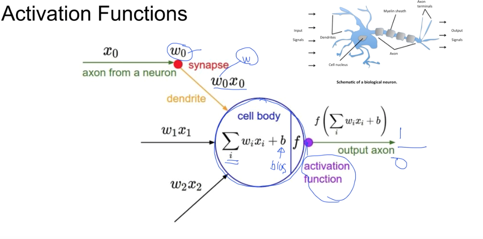
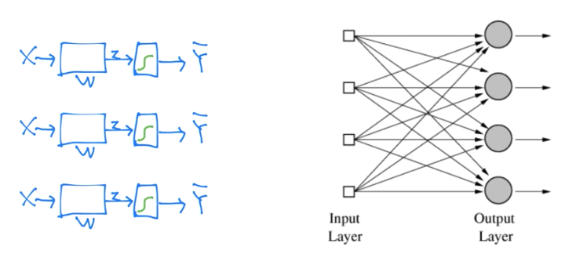
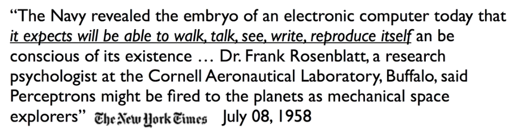
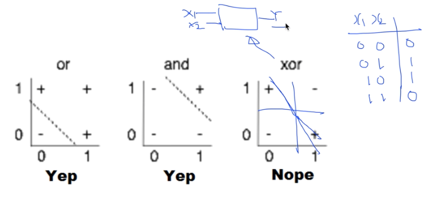
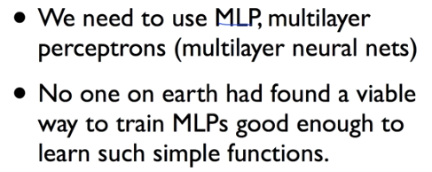
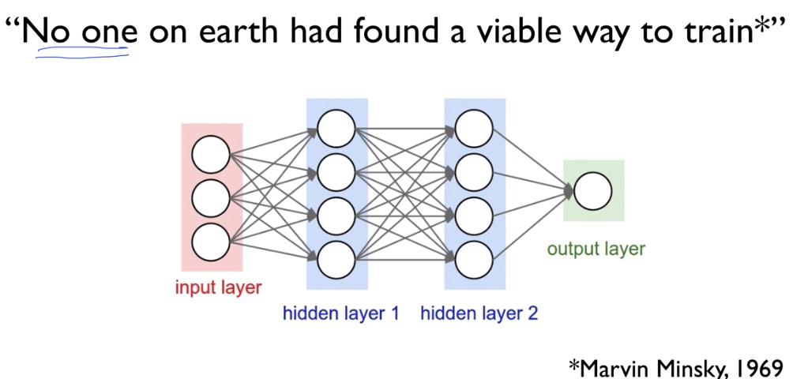
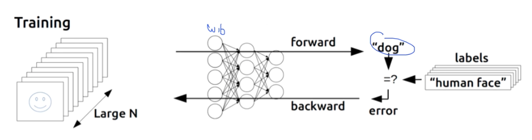
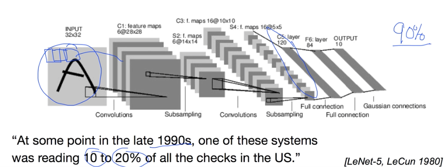
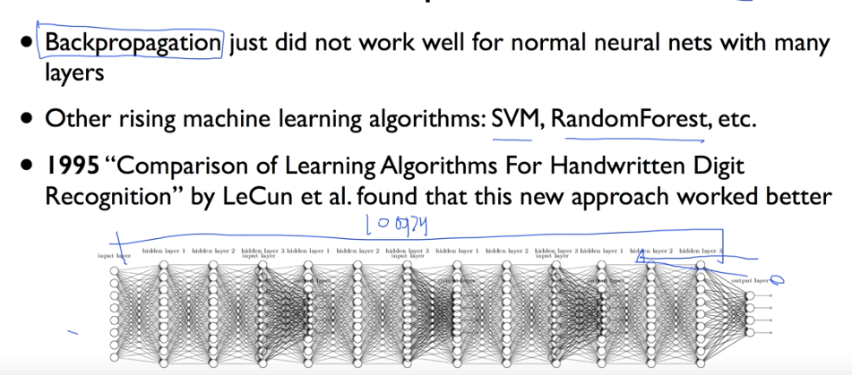

# 8. Lec08-1_Deep Neural Nets for Everyone

## Intro. 딥러닝의 기본 개념: 시작과 XOR 문제

motivation : 인류의 궁극적인 꿈 : 우리를 대신해서 골치아픈 문제를 대신 생각해주는 기계를 만들고 싶다!

그 시작 -> 우리의 뇌를 모방한 기계를 만들자 : Ultimate dream : thinking machine

그리하여, 우리는 여러가지로 접근하였는데, 이를 통해 알게된것이, 1. 우리의 뇌는 생각보다도 훨신 복잡하다!

이보다도 더 놀라운것은, 2. 우리 생각의 unit인 neuron 은 아주 단순하게 작동한다.

그렇다면, 어떻게 그렇게 단순하게 작동하는 걸까.

Neuron -> Input signal 이 있고, 그 값들이 시냅스 내부에서 합쳐진 후, bias가 더해져서 Output 된다음 다음 시냅스로 전달 ! 그런데, 이때, 유심히 보니, 이 합해진 데이터가 어떤 값 이상이 되어야 activate가 되고, 그러지 않으면 활성화되지 않았다.

이를 수학적, 기계적으로 만들겠다! 해서 만든 모델 -> 

Input값에 가중치를 각각 곱한 후 bias를 더한다음 Activation function을 넣어서, 그 결과값이 일정값보다 높을때만 전달되도록하는 model!

__그런데, 뭔가 어디서 본 것 같다?__

—> Logistic regression units와 매우 유사.

인류는 사실 이런 작업을 처리하는 기계를 이미 만들었었다. (1957년 최초의 perceptron hardware, 1960년  Adaline/Madaline)

### False Promises

이렇게, perceptron을 구현한 hardware들이 나오자, 많은 컴퓨터공학자, 수학자들이 허황된 약속(포부)들을 내비치기 시작하였다.

> cf. Dr.Frank는 perceptron hardware를 만든 박사.

그러면서, 많은 과학자들이 관심을 가지게 되었고, 연구가 활발히 발생하게 되면서 어느정도의 성과도 얻기도 했다.

그 예시로, AND/OR  problem

### (Simple) AND/OR problem : linearly separable?

And/Or를 line으로 구분할 수 있는 기계를 만들 수 있다면, 인공지능을 개발할 수 있을 것이라고 생각.

실제로, or 와 and는 line으로 구분이 가능하다 ! -> legister 의 기초가 되는 논리를 구분가능

근데, 문제가 하나 발생 —> XOR은 어떻게 구분할 것인가?

### (Simple) XOR problem : linearly separable?

XOR은 매우 단순한 logic인데, 이를 구분할 수 있는 기계를 어찌 만들 수 있을까? X1,X2를 넣었을 때 도출된 Y값이 XOR을 해결하도록 구분하는 model을 만들 수가 없었음. -> 이때문에 정확도가 매우 떨어지게 됨

## Perceptrons (1969)

> AI 분야의 대가 Marvin Minsky,founder of the MIT AI Lab
>
> 이 1969년도에 책을 펴내는데, 그 책에 XOR 문제는 단일 Line(perceptron)으로 해결할 수 없다고 수학적으로 증명

불가능하다고 말하지만, 이에 대해서 "만약, perceptron 모델을 여러개 합친다면 가능할 수도 있다. 그러나, 각각의 perceptron 에 들어가는 weight와 bias를 학습시킬 수 있는 방법이 없다."라고 말함.

Minsky의 이 발언을 통해서 , AI 발전은 길게는 10년은 후퇴하게 되었다.

하지만, 1986년도에 이를 해결해버린다! (사실, 1974년도에 Backpropagation 으로 해결)

### Backpropagation

Data를 input하여  forward 방향으로  가중치와 bias를 통해 어떠한 prediction  값이 나오면, 그에대한 Error를 구해서 다시 Backward 방향으로 전달하며 W와  b를 수정해 나아가는 방법

이러한 Backpropagation 을 통해 node를 학습시킬 수 있게 되며, XOR 문제를 해결하였다.

한편, 또 다른 교수는 다른 방법으로 이를 해결

### Convolutional Neural Networks

고양이의 뇌를 가지고 확인해 본 결과, 어떤 그림을 보여주며 뇌에 Input 시켰을때, 어떤 그림을 Input시켰느냐에 따라 뇌의 Neural 중 일부만 activate 되고, 어떤 일부는  activate 되는 것을 발견

즉, 이 이야기는 우리의 뇌의 모든 신경망 세포가 모든 데이터를 해석하는데 활용되는 것이 아니라, Input data에 따라 활성화되는 뇌의 신경망이 정해져 있는 것은 아닐까? 하는 질문을 던지게 하였다.

이러한 이론을 통해 Convolutional Neural Networks 를 개발 -> 모든 데이터를 한번에 다 넣고 모든 neural network가 참여하는 것이 아니라, (만약 그렇게 되면 학습이 너무 지나치게 많이 진행)

데이터를 조금씩 잘라서 부분부분을 잘라서 Input한 다음, 나중에 합치는 방향의 Network를 구현(알파고도 비슷한 방법)

이러한 방법으로, 특히 문자나 그림을 인식하는데는 90% 이상의 정확도가 나온다 !

## A BIG problem

> 그러나, 여기서도 안타깝게도 큰 문제를 발견하게 된다.

Backpropagation 이 단 몇개의 layer에 대해서는 잘 작동하지만, 우리가 필요한 network는 복작한 경우 아주 많은 layer의 학습이 요구된다.

그 경우, 데이터를 모두 forward방향으로 진행 후 나오는 Error을 backward로 진행해도, 그 의미가 점점 약해져서 다시 제일 첫부분쪽으로 왔을떄(backward)는 학습이 제대로 되지 않아 성능이 떨어지게 된다.

이러한 문제점때문에 Neural Network를 대체할 많은 알고리즘들을 개발하기 시작하여 SVM, RandomForest 등등이 나왔다.(때론 neural network 보다 더 좋은 성능을 내기도...)

라고 하여, 그 이후 neural network 는 두번째 침체기를 맞게 된다.

