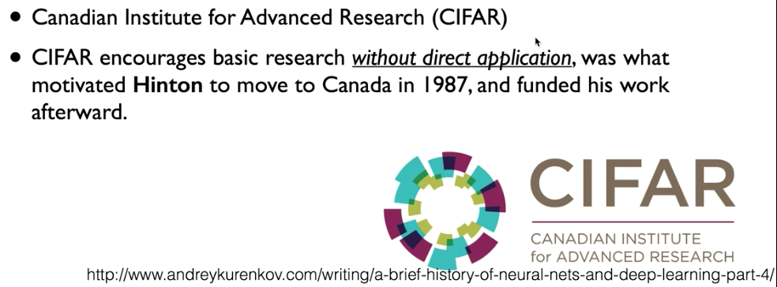
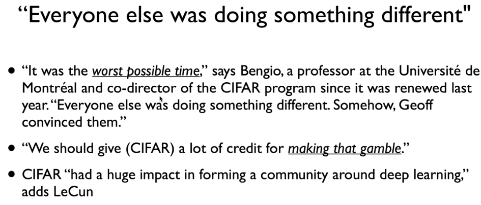
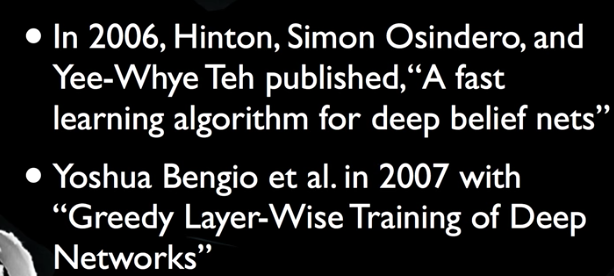
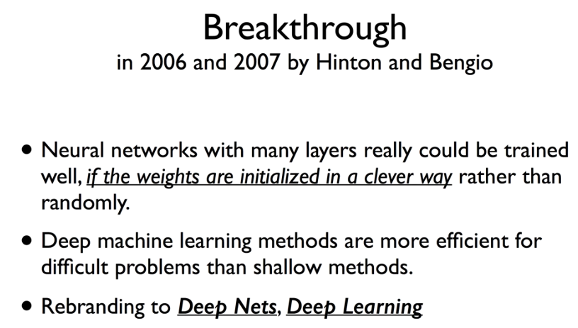
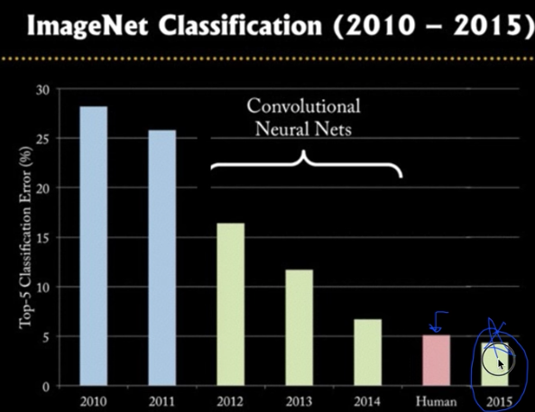
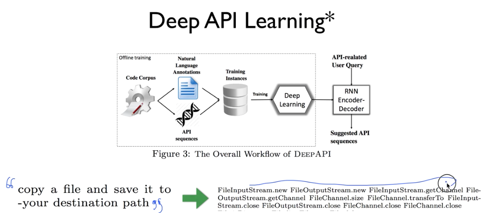
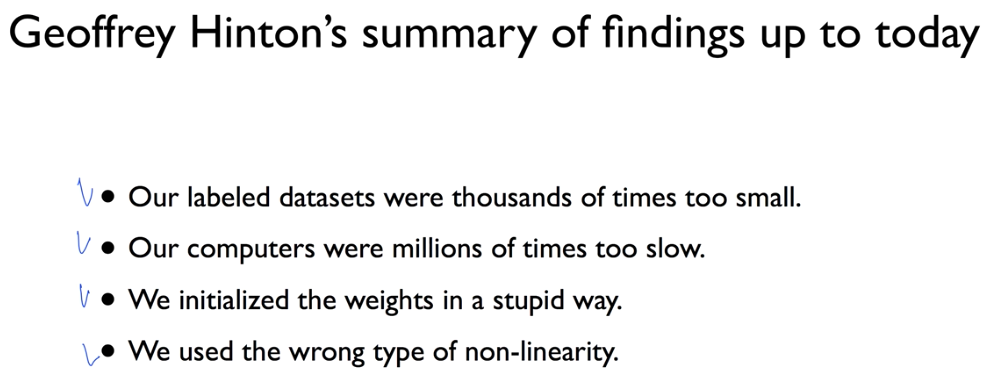

# 8. Lec08-2_Deep Neural Nets for Everyone

## 딥러닝의 기본 개념2 : Back-propagation 과 2006/2007 "딥"의 출현

### A BIG problem

Layer가 아주 많아지면, 우리는 back-propagation 을 해도 전방에 layer에는 그 Error가 전달되지 않는 문제(희미해지는 문제)가 발생한다.

### CIFAR

이러한 CIFAR 라는 단체에 의해서 neural network 의 연구에도 불을 지피기 시작.

돈이 되지 않는 분야에 대해서도 ( 당시 neural network는 reject의 대상이었음.)

이 단체가 아주 힘든 과정속에서 멈추지 않고 deep learning을 연구하여 지대한 영향을 끼침 도박과도 같은 시간들.

단체의 노력으로, 2006년 Hinton, 그리고  2007년 bengio의 논문발표로 breakthrough 가 된다.

1. Backpropagation으로 Deep Net에 대해서는 학습이 안될것이라고 했는데,  만약 weight의 초기값만 잘 준다면 학습이 될것이다.
2. 깊은 신경망을 구축한다면, 굉장히 복잡한 문제까지 풀 수 있다고 논문을 통해 풀었다.

이를 통해 사람들이 다시 주목하기 시작

—>Neural network라고 하면 사람들이 관심을 안주니까, Deep Network라는 이름을 붙임.

### 정말 주목을 받게 된 계기?

__IMAGENET 이라는 Large Scale Visual Recognition Challenge__

그림을 주고, 이 그림이 어떤 그림인지 맞추는 알고리즘, computer vision 을 다루는 대회

2010년까지만 해도 30%에 가까운 Error를 내고, 매년 1~2%정도씩밖에 발전을 하지 못했음. 하지만, 90%이상의 정확도가 나와야 하므로, 앞으로 10년은 더 개발해야겠다는 얘기가 나왔었음. 그런데, 2012년, Hilton 교수의 연구실의 한 학생이 갑자기 10퍼센트 이상 확 줄여 버림 -> deep learning 기반의 모델 -> 2015년에는 3% 의 Error를 보이기 시작 : 사람의 경우 5%의 Error : 즉, 사람보다 더 뛰어난 정확도

더 나아가, 그 그림을 단어를 추출하는 것 뿐 아니라, 그 그림을 설명하는 문제까지도 해결.

### 홍콩과기대 김성훈교수님 연구실에서 개발중인 것

Deep API learning ->  사람이 어떤 기능이 필요한지 말하면 이를 위해 어떤 API가 필요하고, 어떻게 작동시켜야 할지 알려주는 인공지능

여기서도, Deep learning을 이용하기 전까지는 20퍼센트의 정확도뿐이었지만, Deep learning을 사용하게 되면서, 65%의 정확도까지 끌어올릴 수 있었다.

### 그리하여, Hinton이 "왜 그럼 이전까지는 잘 되지 않았을까?"하고 돌아봄

