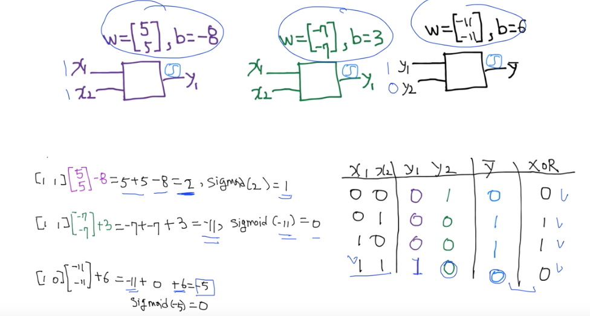
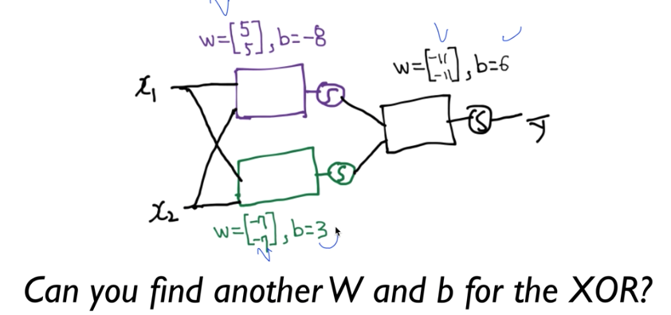
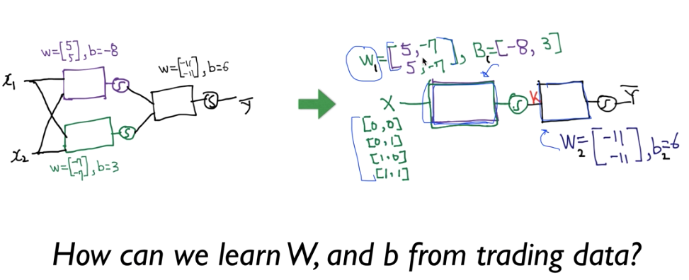
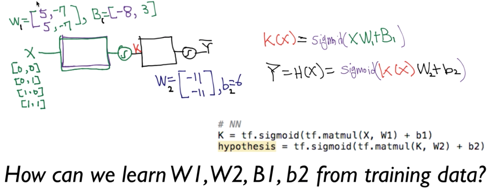

# 9.Lec09-1_Neural Nets(NN) for XOR

> Neural Network 1: XOR 문제와 학습방법, Backpropagation (1986 breakthrough) 

#### 2018.09.26( 수 )

### One logistic regression unit cannot separate XOR

하나의 unit model  로는 XOR 문제를 풀 수 없다고 Minsky가 수학적으로 주장해버림 -> 

하지만, 여러개의 모델을 합친다면, 이를 풀 수 있음 -> 또다른 문제 : 각각의 node에 대해서 w와 b의 학습이 불가 ->

하지만, back-propagation 을 통해 해결할 수 있다.

### XOR using NN

즉, 우리는 두개의 neural net unit으로 XOR 문제를 풀 수 있다는 것까지는 확인이 되었다!

### Forward propagation

그렇다면, 위의 W,와 b를 가진 units말고, 다른 neural network model을 찾을 수 있겠는가?

### NN

우리는 이전에, 여러개의 logistic regression 을 모아서 하나의 모델로 만드는 방법을 배웠음. W 벡터들을 모아서  행렬로 만들고, 시그모이드 대신에 softmax를 썼던..그것.

일단은, 여러개의 unit을 합치는 것 까지는 우리가 배웠음.

그렇가면, XOR을 구별할 수 있는 w와  b값들을 찾기 위해 어떻게  training 시킬 수 있을 것인가