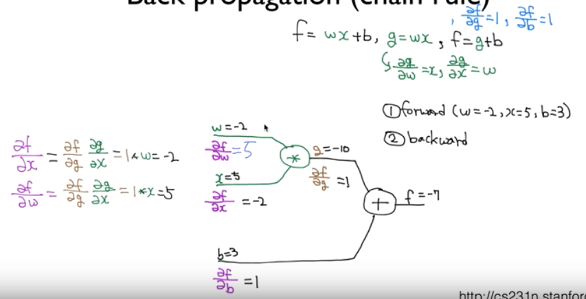
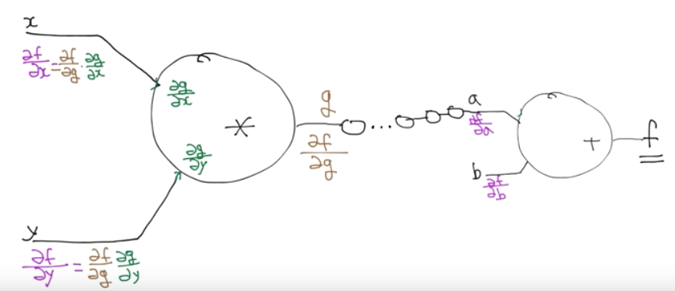
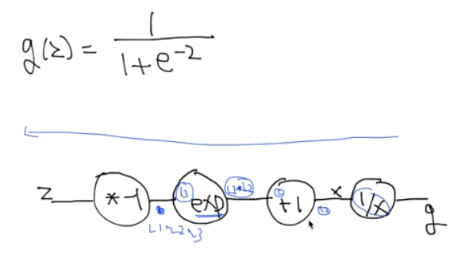

# 9.Lec09-2_Backpropagation

> Neural Network 1: XOR 문제와 학습방법, Backpropagation (1986 breakthrough) 

#### 2018.09.26(수)

### How can we learn W1, W2, B1, B2 from training data?

Gradient Descent Algorithm 을 가지고 학습시킬 수 있다!

cost함수가 convex 함수라면...!

그런데, 여기서 우리가 mimimum한 값을 찾기 위해서는 미분을 하여 기울기를 알아야 하는데, NN으로 가면서 미분값이 지나치게 복잡해진다.! -> 노드가 한개만 있는게 아니라, sigmoid도 들어가고, 여러개의 node가 서로 겹치고 하면서, 모든 node의 미분값을 알아야 최종 cost를 구할 수 있게 됨... -> 계산량이 너무 많아진다.

그리하여, minsky교수는 이것이 불가능하다고 말한것.

### Backpropagation(Chain rule)

하지만, 이것이 Backpropagation 에 의해 해결된다.

우리의 모델을 통해 도출된 error값을 가지고 다시 backward 방향으로 가며 학습

Backpropagation의 핵심 : 아무리 복잡한 model  이 있다고 하더라도, 아주 간단한 ($ f = wx + b$ 에 대한 편미분) 미분정도만 할 수 있다면 역전파하며 학습이 가능해진다.

이때, 미분했을때의 의미?

$\frac{\delta f}{\delta b}  = 1$  이면 b(bias)가 이 model 의 학습에 미치는 영향이 1:1이라는 의미.

$\frac{\delta f}{\delta w}  =5$  라면, w가 1만큼 변할 때 f가 5만큼 변한다는 의미 -> w가 f에 1 : 5로 영향을 준다는 의미

 

위는 한가지 경우로 따져본 것이고, 만약 중간에 수많은 layer가 있다면 어떻게 계산할 수 있을까?

이럴때, 당황하지 말고, 가장 마지막에 있는 노드에서부터 하나씩 차근차근 backpropagation 해주면 된다.

이게 가능한 이유가, 각 노드를 각각으로 보면 f가 어떻게 구성되어있는지 알고있으므로.. 각각을 미분해서 어떤 값이 얼마나 영향을 주는지 찾아내면 된다. (그 값이 이전 노드의 output 값)

이렇게 끝까지 가면, input data 인 x,  y가 각각 얼마나 영향을 주는지 알 수 있다.

> 그렇다면, sigmoid는 어떻게 미분할 수 있을까...

뒤에서부터 차근차근히 chain rule을 적용하면 된다!

g에서부터 f 까지 함수를 쭉 나열하고 하나씩 미분해서 곱해주기.

### Back propagation in TensorFlow

> 우리는 cost 함수의 미분값이 중요하다...
>
> Tensorflow는 이 미분또한 graph로 만들어서 하나씩하나씩 처리한다.
>
> 이를 통해  back propagation 을 진행

즉, chain rule 로 backpropagation 을 구현 !

