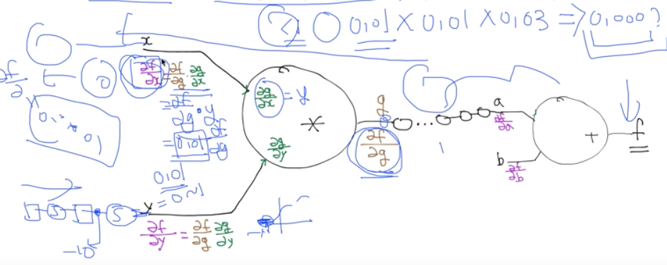

# 10. Lec10-1_ReLU:Better non-linearity

> Neural Network 2: ReLU and 초기값 정하기 (2006/2007 breakthrough) 

#### 2018.09.27.(목)

__Neural network를 deep & wide 하게 구현하는 방법__

1. W1 ~ W3 -> layer의 개수가 세개
2. W1 -> [2,5] : input data 2개(feature가 2개), node 5개(output이 5개)
3. W2 -> [5,4] : input data 5개, node 4개
4. W3 -> [4,1] : input data 4개, output 1개 ->(여기서는, 0 or 1 로 구분)
5. b1 ~ b3 -> layer가 3개, 그리고 각각 node마다 bias가 필요하므로 5,4,1 개로 구성
6. hypothesis -> 서로 output을 input으로 받으며 chain 처럼 구성

### Backpropagation의 문제

-  Layer가 9단, 10단까지 가면서 학습이 제대로 되지 않는 문제가 발생하였다.
- 전달되는 Error가 Backpropagation을 진행하면서 그 값이 희미해짐.

__layer를 9단까지 했음에도, Accuracy가 0.5를 넘지를 못했다. 20만회 학습시켰음에도..__

> Why?

lec9-2 에서 배웠던 Backpropagation 의 원리를 다시 살펴보면, f =x*y + b의 연산을 갖는 node에서 각 미분값(해당 요소의 영향도)이 곱하고 더해져서 전달되게 되는데, 이때 sigmoid 함수가 적용되면서 극히 작은 값이 전달되어버린다. ( sigmoid를 적용한 값이 0 ~ 1사이의 값인데, 이를 chain rule을 통해 여러번씩 곱해지면서 아주 작아지게 됨...)

layer 한두개정도면 그 값이 별로 작아지지 않겠지만, back으로 가면 갈수록 0.1\*0.1\*0.1\*0.1\*0.1\*0.1\* ... \*0.1 이된다면,나중에 아주 뒤쪽의 node는 거의 학습이 되지 않는 문제가 발생한다.

이러한 현상을 __Vanishing gradient(NN winter2: 1986-2006)__ 이라고 부른다.

즉, 최종적으로 나온 Error에 의해 layer가 깊어질수록 Gradient가 사라져 버린다는 의미. 그래서, 학습하기가 매우 어렵다. input data가 최종적인 결과값에 영향을 제대로 미치지 못해서 제대로된 예측이 안된다는 의미

이러한 문제때문에 2006년까지 제대로 해결되지 않으며 또다시 문제에 봉착.

__이는 곧 Hinton 교수에 의해 해결된다.__ : "sigmoid를 쓰는게 아닌 것 같어..."

sigmoid가 문제를 가져왔다 -> 그 결과값이 항상 0 ~ 1사이의 값으로 나오다보니까, 이를 계속 곱하면 최종 결과값은 너무 작아진다.

### ReLU: Rsctified Linear Unit

#### => 이에대한 해결책? : ReLU 라는 activation function을 만들었다!

> ReLU 는 아래 그림과같이, 매우매우 단순하다.

1. z 가 0보다 클때는, 그 값을 그대로 쓴다 -> 0 ~ 1의 값으로 결과값을 국한하지 않는다.
2. z가 0보다 작을때는, 결과값은 항상 0이다 -> activate 하지 않는다.

__이제, neural network에서는 더이상 sigmoid를 쓰면 좋지 못하다__

~~~python
L1 = tf.sigmoid(tf.matmul(X, W1) + b1) 이었던 것을
L2 = tf.nn.relu(tf.matmul(X, W1) + b1) 으로 바꾸어 쓰자.
~~~

사실,relu의 구현도 매우 간단하다!

relu(X) = max(0,X) 인것...

> !!주의!! 

__마지막 hypothesis의 정의부분에서는 sigmoid를 적용해주어야 한다__

우리들이 원하는 출력은  0 ~ 1 사이의 값을 원하므로, output layer 에서는 activation function으로 sigmoid를 써주어야 한다!!

input layer와 hidden layer에서만 relu를 사용한다 !!

### ReLU 말고도 다양한 activation function 을 만들었다.

> ex.

1. Leaky Relu : z<0 에서, 너무 다 0으로 처리하는 것보다, 조금씩은 값을 주자. : max(0.1x, x)
2. ELU : z<0 에서, 우리가 원하는 값을 주자 : $ \begin{cases} x & \text{if}\ x\geq0 \\ \alpha(exp(x)-1) & \text{if} \ x\leq 0 \end{cases} $
3. Maxout : 두 결과값 중 큰 값을 쓰다 : $max(w^T_1x + b_1, w^T_2x+b_2)$ 
4. tanh : sigmoid가 0을 중심으로 있지 않기때문에, -1 ~ 1사이의값으로나오게 함 : $thnh(x)$

 

