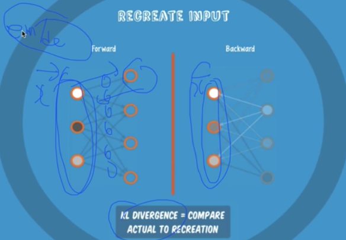
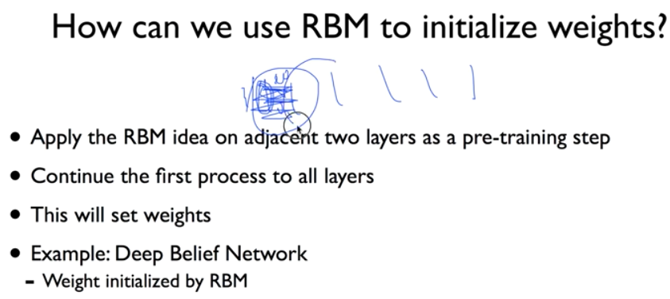
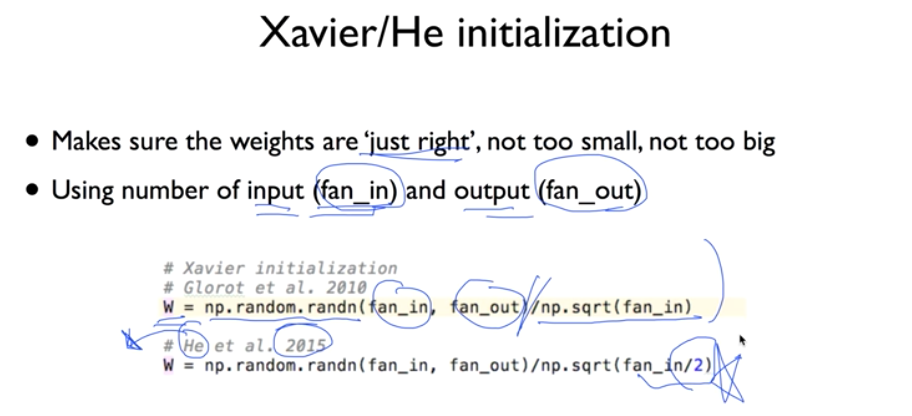
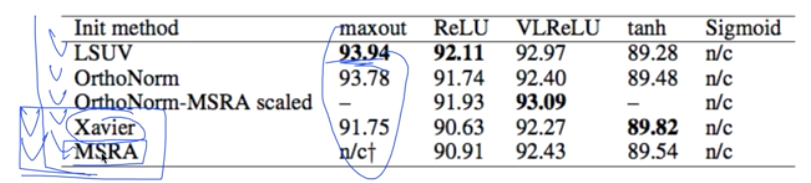

# 10. Lec10-2_Initialize weight in a smart way

> Neural Network 2: ReLU and 초기값 정하기 (2006/2007 breakthrough) 

#### 2018.09.27(목)

> Backpropagation의 문제를 해결하기 위한 방법
>
> 첫번째 : ReLU function 을 activation function  으로 쓴다.
>
> 두번째 : 초기값을 잘 고르자.

### 초기값. 어떻게 할 것인가.

> 같은 구성의 model 이더라도, 최초로 주어진 weight 값에 따라 학습의 결과가 달라진다 !

__만약, 모든 초기값을 0으로 설정한다면?__

Backpropagation 을 진행할 때, W 가 0이되면, chain rule을 적용할 때, forward 로 갈때 $w*x +b$의값이 0이 되어버린다.

그러면서 문제가 발생한다. -> 앞의 gradient가 다 0이되면서 사라져버린다.

__그래서, 우리는 weight 값을 신중하게 줘야한다. 어떻게?__

1.  모든 값은 0이 되어서는 안된다.
2. 2006년 Hinton : "A Fast Learning Algorithm for Deep Belief Nets"라는 논문
   - Restricted Boatman Machine (RBM) --> 딥러닝을 하면서 정말 많이 얘기되는 내용
   - 이를 이용하여, 초기값을 정하는 것을 Deep Belief Nets 라고 부른다.

> Restriction? : 같은  layer의 node끼리는 서로 연결되어있지 않고, 다음 node하고만 연결

### Restricted Boatman Machine

> NN중 가장 앞쪽 두개의 layer만 보고, RBM을 진행한다. 우리는 입력을 계산해 낼 것이다.

1. 가장 처음의 두개의 layer만 일단 뽑아내서, 아래 과정을 여러번 반복하며 w, b를 찾는다.
2. input data에 따라 Forward 방향으로 연산을 진행해준다.
3. 그리고, 그 결과값을 다시 똑같은 w,b 값으로 Backward 방향으로 연산을 진행해준다.
4. 그렇게 해서 도출된 input data 와 기존의 input data 를 비교해서, 그 차이를 적게하는 w, b 값을 정해준다.

이는,  encoder / decoder 라고도 불리기도 한다.

__RBM 의 idea__

### Deep Belief Network (DBN)

아주 깊은 Neural Network가 있다.

__PRE-TRAINING__

1. NN의 맨 앞 두 layer만 뽑아서 RBM 을 진행하여  input값을 결정
2. 그 다음 두 layer ( 첫번째의 두 레이어가 1, 2번이었다면, 여기서는 2,3번 layer) 에서 또 RBM진행
3. 이를 반복하여, 맨 뒤의 layer 까지 RBM 진행

그러하면, 각 node들의 weight들의 초기값들이 모두 결정된다.

__FINE TUNING__

그 이후에 학습하듯이  이미 알고있는 label을 가지고 backward 방향으로 학습(이라 쓰고 튜닝이라 부른다. -> 이미 어느정도 잘 결정된 weight를 가지고 진행하므로)을 진행한다.

__이것이 바로 2006년에 세계를 깜짝놀래킨 논문의 내용인것...__

"Backpropagation 문제 해결 어떻게 하지" -> "초기값을 잘 줍시다." -> "초기값을 어떻게 잘 주지" -> RBM!

> 이때, Good news가 있다.

1. 굳이 RBM 을 통해 weight 초기화를 하지 않아도 된다.
2. 아주 간단한 방법으로도 사실 가능하다.
   1. Xavier initialization : 몇개의 input, 몇개의 output인지에 따라서 이에 비례해서 weight를 결정하자.
   2. He's initialization : Xavier 를 개선

! RBM 보다 훨신 간단하다 !

> 특히, He's initialization 을 통해  imageNet 의 결과에서 error가 3퍼센트 이하로 떨어지게 된다!

__아주 좋은 성능과, 아주 간단한 방법__

#### 연구자들이 여러가지 activation function과 init method 를 적용하여 정확도를 계산해 보았다.

### 사실, 이 분야는 아직도 연구가 많이 진행되고 있다.

아직 답이 없다. 그러므로, 여러가지 방법으로 실행을 시도해보고 그 중 잘되는 것을 고르는게 중요하다.

