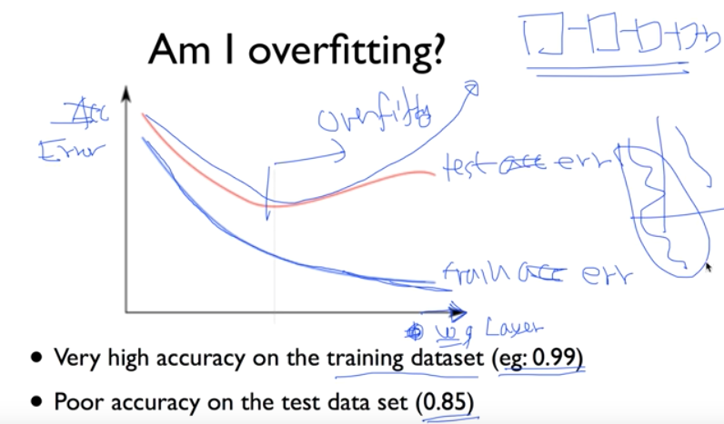
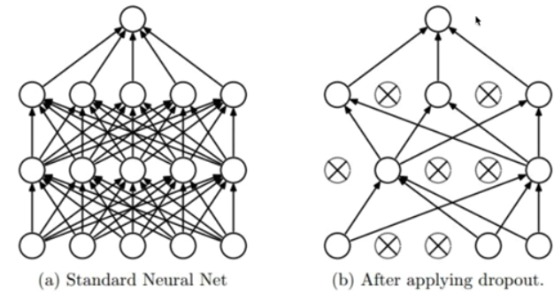
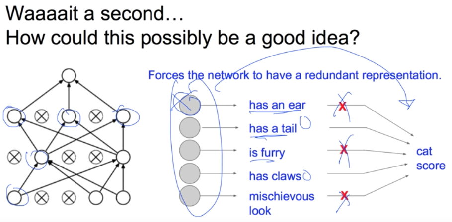
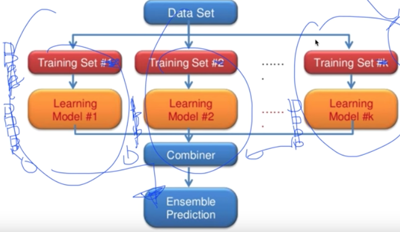

# 10. Lec10-3_NN dropout and model ensemble

> Neural Network 2: ReLU and 초기값 정하기 (2006/2007 breakthrough) 

#### 2018.09.28(금)

## Intro

### Overfitting

__overfitting 인지 아닌지 어떻게 알 수 있을까?__

-> training dataset 으로는 높은 정확도가 나오지만, Test dataset으로는 낮은 정확도가 나오면 overfitting!

> 마치, 문제를 달달달달 외워서 똑같은 문제의 모의고사를 풀면 높은 점수가 나오지만, 새로운 문제는 못푸는 것.

Layer를 아주 많이 중첩해서 학습하다보면 Training dataset 에 대한 Error는 계속해서 줄지만, 어느 순간부터 Test dataset 에 대한 Error는 상승하게 된다 -> overfitting

> Why? Layer를 중첩한다는 것은, 모델을 더 복잡하게 -> line이 아니라 중간중간에 꺾이는 부분이 있게 하는 것.




### Solutions for overfitting

- More training data!
- ~~Reduce the number of features~~ -> 하지만, NN에서는 적당하다면 features를 억지로 줄일필요는 없다.
- **Regularization**

### Regularization

- Let's not have too big numbers in the weight

- $ cost + \lambda \sum W^2$

- ``` python
  12leg = 0.001 * tf.reduce_sum(tf.square(W))
  ```

- 여기서  $\lambda$가 0.1이면 굉장히 중요하게 생각하는 W이다 라는 의미


## Regularization : Dropout

### Dropout: A simple Way to Prevent Neural Networks from Overfitting [ Srivastava et al.2014]  

> 사실 되게 단순하면서, 황당한 생각 ->이미 만든 node중 몇개를 그냥 없애자는 것.

__"randomly set some neurons to zero in the forward pass"__



> 이게 왜 되는가?

각각의 node들을 몇몇의 전문가들이라고 하자. 그러면, 이를 훈련시킬때 전부 다 같이 훈련시키는것이 아니라, 그 중 몇몇씩 뽑아서 훈련시키고, 몇몇은 쉬고 이러면서 rotation 돌리는 것. 

그렇게 학습이 되고 나면, 모든 전문가들을 총 동원해서 예측을 하면 효율이 좋다 !




> 그럼 이걸 Tensorflow에 어떻게 구현할까?
>
> dropout 이라는 layer만 통과시켜주면 된다 !
>
> _L1이라는, 우리가 평소에 만들던 Layer를 만들고, 이를 dropout을 통과시켜서 L1이라는 최종적인 결과를 뱉으면 됨

__dropout : __

~~~python
dropout_rate = tf.placeholder("float")
_L1 = tf.nn.relu(tf.add(tf.matmul(X,W1),B1))
L1 = tf.nn.dropout(_L1, dropout_rate)
~~~

__Train : __

> dropout_rate 는 몇퍼센트를 참여시킬까? 정도임. -> 0.5? 정도 : 여기서는 70%만 참여

```python
sess.run(optimizer, feed_dict= {X: batch_xs, Y: batch_ys, dropout_rate: 0.7})
```

__Evaluation : __

> 실전에서는 dropout_rate을 1로 설정하므로써, 모든 node가 참여해야만 한다.

```python
print("Accuracy : ",accuracy.eval({X: mnist.test.images, Y: mnist.test.labels, dropout_rate: 1}))
```


## Ensemble?

__기계가 많고, 학습시킬 수 있는 dataset이 많을 때 사용__

사실 같은 training set으로 학습된 다른 모델도 되고, 다른 training set으로 학습된 다른 모델도 같음.

여러개의 모델을 combine 하여 하나의 Ensemble Prediction 을 진행하는것.

> 한명의 전문가한테 물어보는 것보다, 여러명의 전문가에게 묻는 것임.

적게는 2%, 많게는 4~5%까지 성능이 향상된다.



