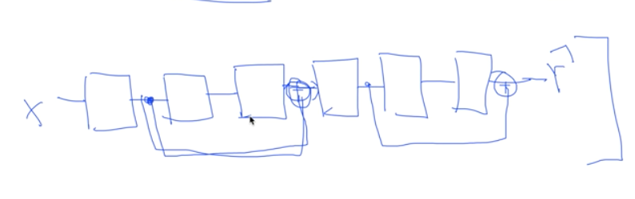
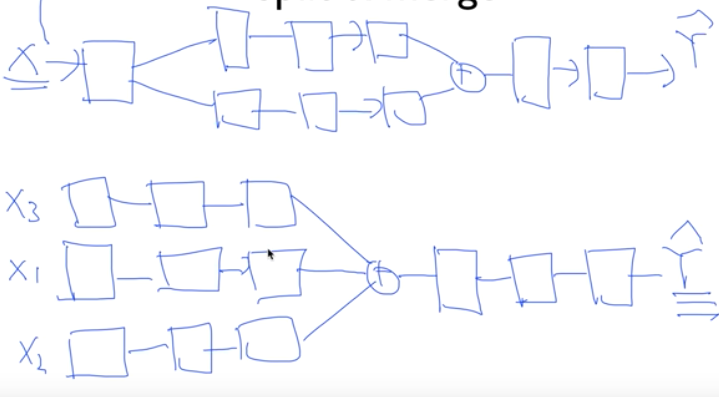
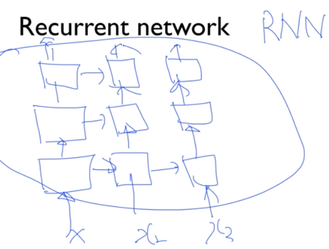

# 10. Lec10-4_NN LEGO Play

> Neural Network 2: ReLU and 초기값 정하기 (2006/2007 breakthrough) 

#### 2018.09.28(금)

## Intro

### Feedforward neural network

이제, 우리는 여러개의 neural network 를 레고처럼 쌓아서 만들 수 있다.

### Fast forward

forward 방향으로 가던 neural network model에서, 중간 결과물을 다다음 결과물에 합쳐주는 식으로 진행하는 model 을 만들어 He가 Imagenet에서 Error 를 3%이하로 줄인 적이 있다.

즉, 이렇게 model을 다양하게 여러가지 방법으로 설계해 볼 수 있다.

> 이런식으로 forward로 두단계씩 다음꺼에 합쳐주고 그런 model 뿐 아니라, slpit & merge 를 이용할 수도 있다.

### Split & merge

1. 출력값을 다른 모델에 Input으로 넣어서 각각 학습시킨다음에 나중에 merge 한다음 더 학습시켜서 prediction 하는 등, split & merge 기법을 활용하여 다양하고 다채로운 모델을 설계할 수 있다.

2. 아니면, Input을 여러개로 나누어서 이를 각각을 처리하는 모델을 만들어 독자적으로 학습을 진행하다가 그 결과를 합쳐서 prediction 을 할 수도 있다.
3. 이런식으로 다양하게 설계를 하면, 더 나은 정확도를 가진 모델을 만들수도 있고, 아닐수도 있다. 

### Recurrent network

__forward 로만 데이터가 흐르는 모델말고, 옆으로도 흘러 갈 수 있다.__

모델 설계는 내가 하기 나름 !

### "The only limit is your imagination"

즉, 우리는 이제 어떠한 형태든지, 여러가지의 모델을 설계해 본 후, 좋은 결과가 나오면 그게 바로 나만의 NN이 되어 좋은 문제를 더 잘 풀어낼 수도 있다.

상상력을 발휘하여 여러가지를 해봐서, 레고를 조립하듯 NN을 활용해보자.