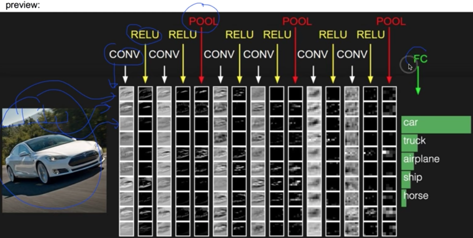
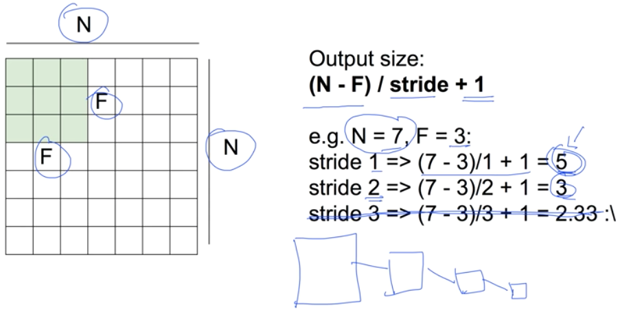
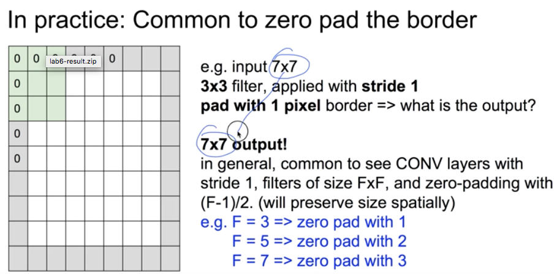
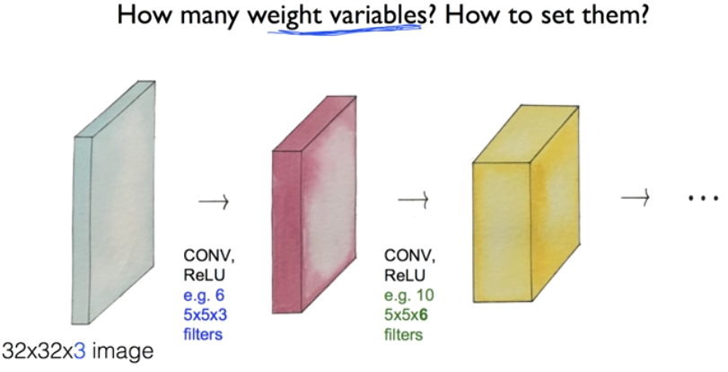

# 11. Lec11-1 CNN introduction

> Convolutional Neural Networks 

#### 2018.09.28(금)

## Intro

__"The only limit is your imagination"__

Layer 들을 여러개 붙여서 만든것 : Farward 라고 부르기도 하고, Fully Connected 라고 부르기도 한다. (전부 연결)

하지만, 우리는 더 다양한 network 를 상상해볼 수 있다.

__예를들면, Input data를 여러개로 쪼개어 나눈다음 layer 에 삽입하는 것__ : 이것이 CNN의 기본 IDEA

## Convolutional Neural Networks

[자료 Lec7](http://cs231n.stanford.edu/)

1. 이 CNN은 고양이의 인지 실험에 착안하여 처음으로 고안되었다.

   > 고양이에게 여러가지 형태의 이미지를 시각적으로 보여주었을때, 모든 뉴런이 작동하는 것이 아니라, 이미지의 형태에 따라 선택적으로 작동하는 뉴런들이라는 것.

2. 이에 착안하여, CNN 에서는 하나의 image를 여러개로 나누어 각각의 작은 이미지로 나누어 Input으로 넘긴다.

   __이를 처리하는 layer를  Convolutional Layer ( CONV ) 라고 부른다__

3. CONV 이후에 RELU layer(학습 층)를 삽입하여 학습을 진행

4. CONV 를 한번만 적용하는 것이 아닌, CONV 와 RELU 를 반복적으로 실행

5. 중간에 Pooling을 진행하여 CONV의 결과 데이터의 크기를 줄이거나 특정 데이터를 강조

### CNN의 과정

1. Start with an image(width * hight * depth ) : 이때, depth는 color로서, 0 ~ 255의 값 3개. 즉, 3이된다.

2. Let's focus on a small area only : 고양이 실험에서 얻은 인사이트와 같이 이미지의 일부분만 뽑아낸다

   > 이때, small area 의 크기는 적당히 선택할 수 있다.
   >
   > 여기서, filter는 이 small area를 하나의 값을 만들어낸다 ! : One number

3. Get one number using the filter

   > 이렇게 focus 하고있는 small area를 filter를 통해 하나의 숫자(one number)로 표현한다.
   >
   > 이렇게 표현된 하나의 숫자를 x라고 하여, 이미지 전체가 아닌,표현된 one number 만 input으로 이용한다.

   —> 그렇다면, 어떻게 small area를 하나의 숫자로 표현할 수 있을까??

   __$one\ number = Wx\ +\ b$__

   즉, 이렇게 다변량회귀 이용하여 하나의 숫자로 만들 수 있다.

   >  예를들면, 만약 5\*5\*3 (5\*5pixel의 small area)라고 하면 75개의 input data겠지만,만약 input data가 5개로(x1,x2,x3,x4,x5) 만 있다고 한다면.
   >
   > 이를 하나의 값으로 만드는 것은 다변량회귀를 진행하듯이 해주면 될것이다.
   >
   > —> $w_1x_1 + w_2x_2 + w_3x_3 + w_4x_4 + w_5x_5+b$ 
   >
   > 이때, w의 형태에 따라서 결과가 $\hat{y}$ 로 하나의 숫자로 만들어 낼 수 있다.
   >
   > 여기서  w(weight)가 바로 어떤 숫자를 만들어 낼지 결정하는 filter 의 값이라고 할 수 있다!!

   원한다면, $ = ReLU(Wx+b)$ 로 해주어서 ReLU layer를 자연스럽게 넣어줄 수 있다!

4. Let's look at other areas with the same filter (w)

   > 우리는 전체를 보아야 하기 때문에, 다른 small area도 봐주어야 한다.
   >
   > 이때, 똑같은 filter( 같은  w값)를 가지고 다른 부분의 이미지를 보자.

   이를 위해, 그 small area 를 옆으로 window scan 하면서 본다.

​	__그렇다면, 우리는 이 하나의 image 에서 몇개의 number를 얻게 될까?__ 

​		—> 이는 중요한 문제이다. 왜냐하면, 그 다음 Layer의 input data가 되기 때문에!

> 용어 정리 : stride -> window scan 할때, 몇칸씩 옮기는지 : ex) stride :2 이면, 두 pixel 씩 옆으로 이동

 즉, output image의 size(one number 의 개수 !)는 $(N - F) / stride + 1 $이 된다 .

__여기서, output size는 Input size 에 비해 작아진다는 것을 알 수 있다.__

__이는 곧, 정보를 잃어버린다는 것을 의미__

—> 그래서, 이 convolution을 사용할때는 padding이라는 개념을 사용한다.

: padding -> 이미지의 맨 끝에 dummy로 1pixel 짜리 border가 있다고 가정해보자 !

두가지 기능

1. Input image가 output image 로 도출되면서 그 크기가 급격히 작아지는 것을 방지
2. border 에 0값을 넣으므로써, model에 "여기는 테두리입니다."라고 알려주는 기능

즉, 0 value를 갖는 padding 을 추가해주므로써, stribe가 1일때 input data size 와 output data size 가 동일하게 바꿔주었다.

5. Swiping the entire image

   그렇게 도출된 output data를 다시 input으로 하여 convolution  을 진행할 수도 이다. : CONV layer 들의 중첩

   이를 정말 여러번 반복해 준다면, "activation maps" 가 도출

6. Convolution layers

   CONV, ReRU 를 여러개를 chain 처럼 여러개 적용 : 이때,  imgae의 depth는 5\*5\*3 일때 6으로 잡고 진행된다

   즉, 여기서 5\*5\*6  의 "6" 은 원래의 image에 6개의filter(각기 다른 w를 갖는…)를 적용하였기 때문에, depth가 6인것 !

> 즉, weight variable의 개수는 직전의 output 의 size. 즉, 여기서 빨간색 부분의 network는 5\*5\*3의 weight 만큼 필요
>
> 그렇다면, 이 w값들은 어떻게 정해지는가? --> 처음에는 random으로 초기화 또는, Xavier 처럼  Initialization mathod를 이용하여 초기값을 정하자.
>
> 그리고, 기 이후에 w를 학!습! 하는것.

### Reference.

[김태완님 블로그](http://taewan.kim/post/cnn/)

