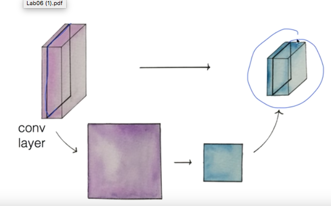
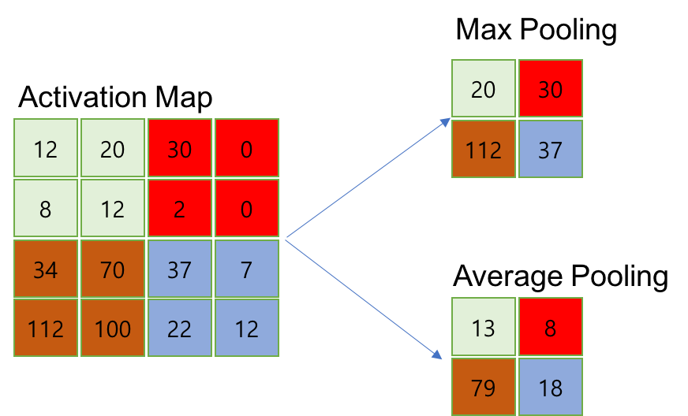
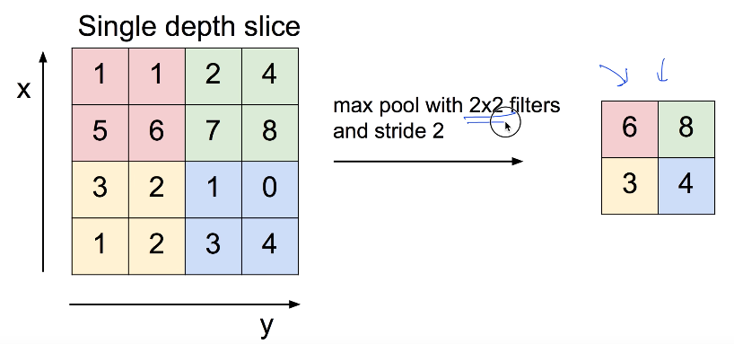
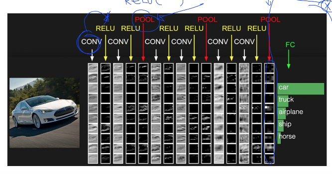

# 11. Lec11-2 CNN introduction: Max pooling and others

> Convolutional Neural Networks 

#### 2018.09.29(토)

## Intro.

Lec11-1에서 CNN의 instroduction  을 익혔고, 이제 앞서 설명되지 않은 Max poolling과 나머지에 대한 설명

CNN  전체 구조를 보면, CONV 와 RELU 가 번갈아 진행되다가 중간중간에 POOL을 한번씩 진행해 준다.

그렇다면, Pooling은 무엇인가? -> 간단하게 보면, Sampling 이라고 할 수 있다.

## Pooling layer ( sampling )

> CONV 에서, depth 는 몇개의 fillter를 이용하느냐에 따라서 결정됨.

1. CONV 에서 하나의 layer만 뽑아낸다.
2. 그러면 그 layer에 각 값이 있을 것. 이를 resize (sampling) -> 그 layer를 작은 사이즈로 만드는 것.
3. 그렇게 resize된 (sampling된) layer 를 다시 합쳐주면 그것이 Pooling!

> 그렇다면, 이를 어떻게 할까?

## MAX POOLING

filter 내의 가장 큰값을 채택하여 sampliing(resize)하는 방법.

> filter  내의 대표값 하나를 채택하기 때문에 sampling 이라고 함.

이때, resize 된 layer 의 size는 filter 와 stride 에 의해서 결정

## Fully Connected Layer ( FC layer )

\- Contains neurons that connect to the entire input volume, as in ordinary Neural Networks

이 안의 CONV, RELU, POOL layer 들의 순서와 구조,깊이를 창의적으로 설계하여 하나의 모델을 만들 수 있다.

이렇게 해서 최종적으로 나온  Output 값을 Softmax layer를 통해 각 결과값을 분류해 낸다.

### [이것이 어떻게 동작하는지 웹에서 시각화된 것을 확인하기](http://cs.stanford.edu/people/karpathy/convnetjs/demo/cifar10.html)

