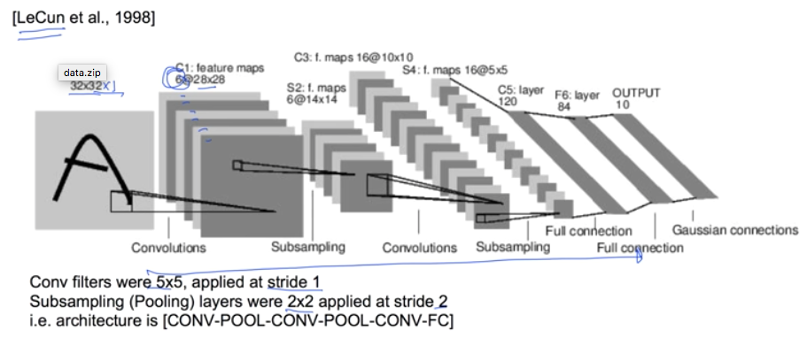
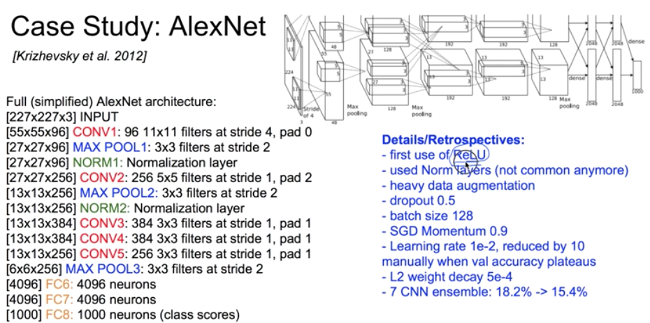
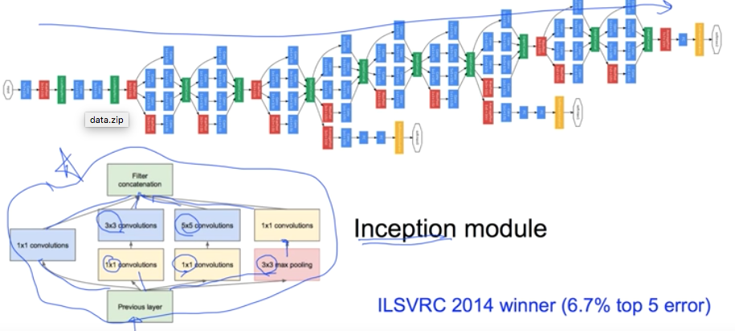
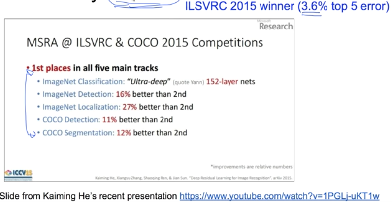
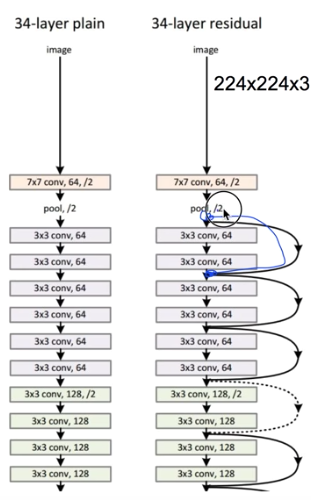
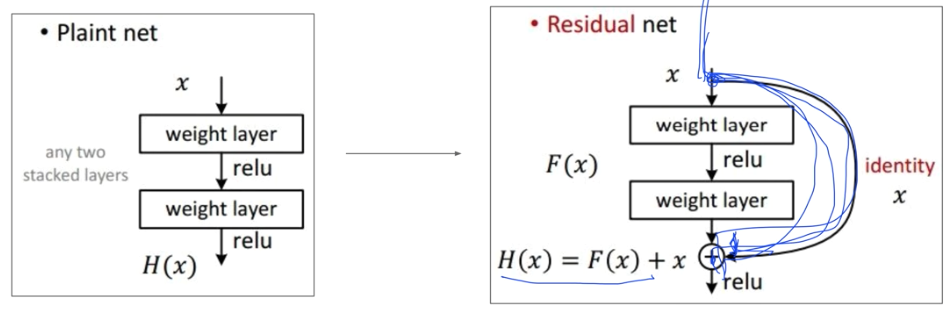
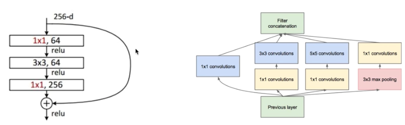
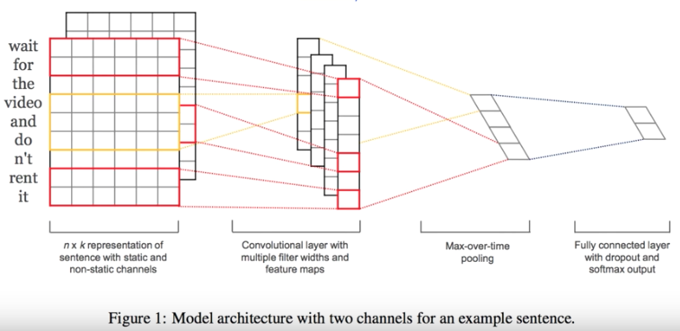
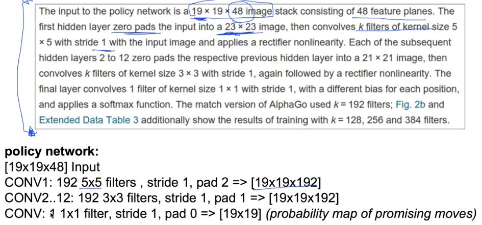

# 11. Lec11-3 CNN case study

#### 2018.09.29. (토)

## Intro

우리가 지금까지 배운  기본적인 CNN을 많이 응용해 볼 수 있다.

사람들의 응용들을 살펴보고, network  를 구성해보자.

## Case Study1 : LeNet-5

> 거의 처음으로 나온 CNN 모델

filter  로 5\*5 , stride 1 로 진행되었으며, CONV, Pooling, CONV, Pooing을 반복하여 진행.

이때, filter의 개수에 따라  다음 layer의  depth가 변하는 것에 주의 : 1 -> 6 -> 16

padding 을 별도로 주지 않아서 CONV 를 진행했을 떄 map 의 크기가 줄어드는 것을 확인할 수 있다.

## Case Study2 : AlexNet

> 2012년, ImageNet에서 1위를 차지하며 굉장히 큰 관심을 갖게 됨.

__Input data & First layer__

1. Input data 가 227\*227\*3 size의 정방형 Colour 이미지를 사용한다.

2. 첫번째 layer( CONV1 )은 96 개의  11\* 11 \* 3짜리 filter로 stride 4 로 진행된다.

   -> 여기서, Output 으로 [55\* 55\* 96]이 도출 

3. (N - F)/stride +1 = (227-11)/4 + 1  = 55로, padding  없이 진행, filter 자체가 colour 기 때문에, 96:filter 의 개수만큼 depth로 도출

4. 그러므로, 첫번째 layer의 parameter는 (11\*11\*3)\* 96 = 35K : 첫번째 layer에서만 35K의 parameter가 요구된다.:  각 filter에서 필요한 w의 개수 \* 96개 filter

__Second layer__

1. 첫번째 layer(CONV1)으로부터  [55\*55\*96]의 Data를 Input한다.

2. 두번째 layer(POOL1)는 3\*3 짜리 filter 로, stride 2로 진행 : 모든 layer를 resizing 하는 것이므로, 필터의 개수는 따로 없다.

   --> 여기서, output으로 [27\*27\*96]이 도출

3. (N - F)/stride +1 = (55-3)/2+1 = 27

4. Pooling 에는 별다른 parameter 를 적용하지 않고 진행된다. max pooling 이면 최대값만 뽑아낼 뿐 , w를 곱하거나 하지 않는다.

__layer를 계속해서 반복진행__

조금 깊어보이지만, 하나씩 하나씩 보면 이해가 된다.

>  도중, NORM이라는  layer가 있는데, 이는 도출된 output을 normalization 하는것. 그러나, 최근에는 잘 쓰지 않는다.

__이 network를 한번만 진행한 것이 아니라, 이러한 network 7개를 만들어 ensemble 하였다.__

이를 통해, 18.% -> 15.4% 의 Error reduce 에 성공

## Case Study3 : GoogLeNet (Szegedy et al., 2014)

### Inception module?

1\*1 CONV 3개와 3\*3 짜리  POOL 1개를 병렬적으로 만든다음 각각  CONV 를 사용, 각각의  결과를 합쳐서 output을 낸다.

그리고, 이를 매우 Deep 하게 Network 를 만드는, 창의적인 모델

## Case Study4 : ResNet(He et al., 2015)

> 2015년에 ILSVRC 에서 Error를 3.6% 로 떨어뜨리며 우승 -> 사람의 Error인 5%를 능가.

이후, 계속해서 상을 받을정도로 우수한 Network 로, 잘 숙지해서 활용하면 좋다.

1. AlexNet은 8개의 Layer(2012년 우승), VGG는 19개의 Layer (2014년 우승)

   __ResNet은 무려 152개의 Layer(2015년 ILSVRC 우승)__

2. 8개의  GPU machine 으로 무려 2~3주간 학습. (하지만, VGG  보다 빠르다 ! 무려 8배의 Layer 개수임에도...)

   > How?? Fast Farward 라는 개념을 사용하였다 !

   >  보통의 경우, layer가 있을때, 그냥 쭉 이어져있다. 하지만, residual 의 경우, 중간에 건너뛰고 나중에 다시 합쳐지는 Layer 들이 있다. -> 이게 왜 더 학습이 잘 될까??

   

   > layer를 건너뛰기 때문에 전체적인 depth는 굉장히 깊지만, 어떻게 보면, layer들을 하나로 합쳐진다고 볼 수 있다.
   >
   > 그래서, layer의 개수는 크지만, 실제로는  layer가 깊지 않은 느낌으로 학습할 수 있다.
   >
   > 이것이 잘되는 이유라고 대충 생각할 수 있다.

   

### GoogLeNet  과 ResNet은 서로 다르지만, 비슷한 아이디어라고도 볼 수 있다.

#### CNN을 가지고 Image 만 처리할 수 있는것이 아니라, 다양하게 이용될 수 있다.

## Convolutional Neural Networks for Sentence Classification.[Yoon Kim, 2014]

#### CNN을 활용하여, Image가 아닌, Sentence를 분류하므로써, NLP 에 적용한 사례.

## Case Study Bonus : DeepMind's AlphaGo

AlphaGo 또한 CNN 을 이용하였었다.

