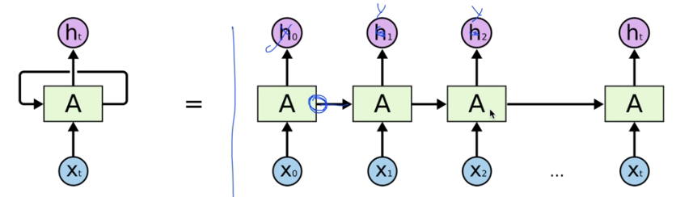
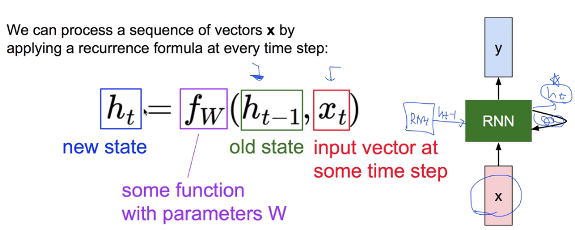
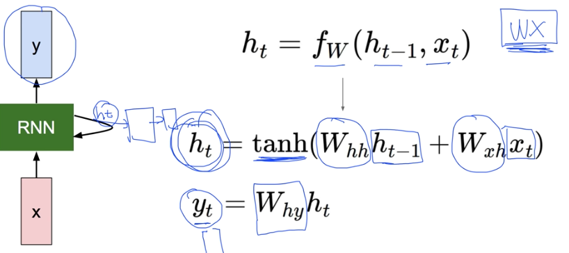
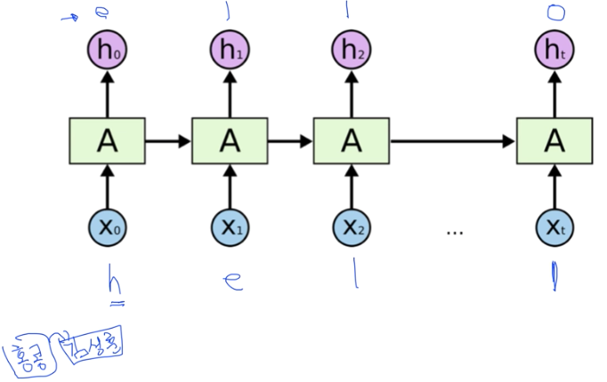
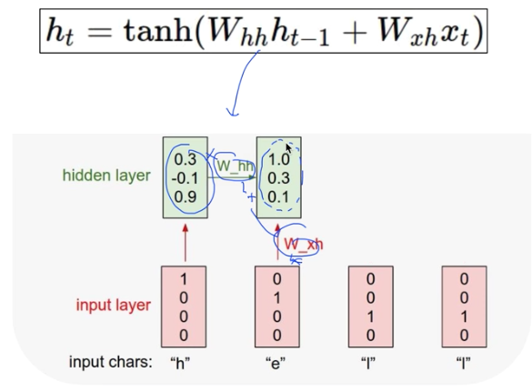
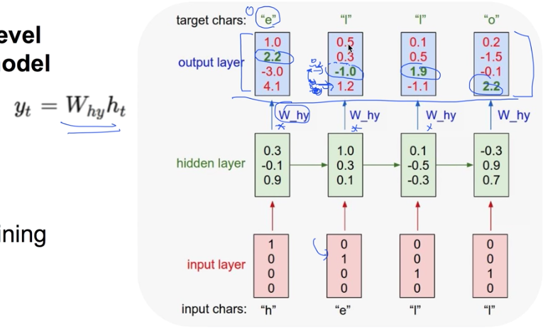
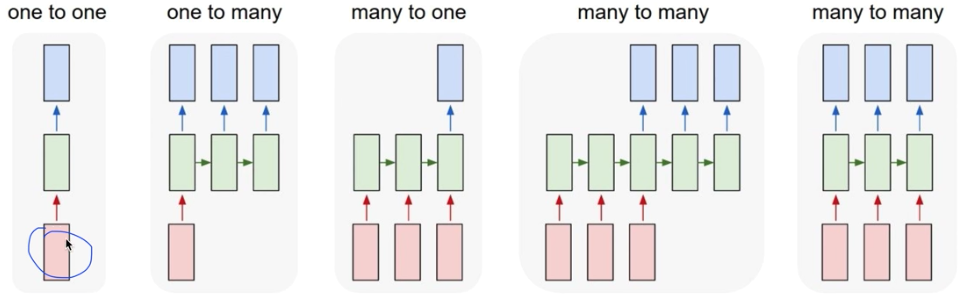
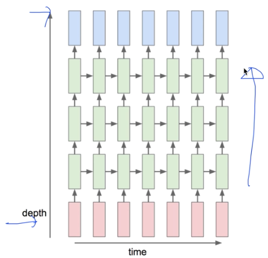

# 12. Lec12 RNN

> Recurrent Neural Network

#### 2018.09.30. (일)

## Intro.

우리가 쓰는 neural network 중에서도 많이 사용하고, 그 중 꽃이라고 할 수 있는 RNN

### Sequence data

우리가 사용하는 데이터 중에는 Sequence data들이 많이 있다.

예컨데, 음성인식이나, 자연어 같은 것들이 모두 Sequence data로 되어있다. 말을 이해하기 위해서는 맥락을 이해해야 한다.

- We don't understand one word only

- We understand based on the previous words + this word.(time series)

- NN / CNN cannot do this

  > NN 이나  CNN 은 각각의 data에 대해서 output을 내는 것이기 때문에, series data를 처리하기는 어렵다.

__이전에 입력되어 도출된 상태(status)가 다음 입력에 영향을 미치게하는 model이 필요__

즉, 어떤 시점에서의 연산을 할 때, 이전의 연산 결과들이 영향을 미친다. -> series에 굉장히 적합한 모델

## Recurrent Neural Network

__그렇다면, 이를 어떻게 계산할까?__

RNN에는 state라는 개념이 있다. 일단 이를 계산해 주어야 함.

여기서 중요한것은, state의 정의에는 <u>이전의  state와 x_input이 입력값으로 들어간다는 것</u>을 기억해야함

여기서, 사람들이 RNN을 여러개가 아닌 하나의 연산에서 loop  로 표현하는 이유는 $f_w$ 이 각 step 에서 동일하게 적용되기 때문에 그렇다. 즉, old state를 계산할때의 $ f_w$  와 new state를 계산할때의 $f_w$   가 같은 연산이라서, 마치  loop로 표현하는 것.

==Notice : the smae function and the smae set of parameters are used at every time step.==

## (Vanilla) Recurrent Neural Network

> 그렇다면,  $f_w(h_{t-1},x_t)$는 어떻게 계산되어지는가? -> 여러가지 방법이 있지만, 가장 기초적인 연산방법은?  

가장 기초가 되는 RNN의 연산방법 ( 딥러닝하는 사람들이 제일 좋아하는  WX )

<u>The state consists of a single "hidden"vector h:</u>

WX에서, 기존의 state와 지금의 input에 각각  W(가중치)를 곱해서 더한다음 tanh()을 씌워 $h_t$를 만드는 방식.

그 이후, $h_t$  에 또다른 가중치 $W_{hy}$  를 곱하여 ouput 값 $y_t$  도출

여기서 $y_t$ 가 몇개의 vector로 (몇개의 결과값으로 )나오는지는 $W_{hy}$  의 형태가 결정

즉, 우리는 A 에서 세개의 weight를 사용한다. -> [$W_{hh}$,$W_{xh}$,$W_{hy}$] -> <u>그리고 이 함수의 모형은  step이 반복되더라도 항상 똑같다는 것을 기억</u>

## Example: Charater-level language model example

Vocabulary: [h,e,l,o]

Example training sequence: "hello"

__현재 글자가 있을때 다음 글자는 뭘까? 라고 예측하는 시스템을 RNN을 통해서 구현__

이를 위해서는 일단 글자를 vector로 표현해주어야 하는데, 여기서는 one-hot encoding  을 이용합시다.

우리가 쓰는 vocabulary에 4가지만 있으므로,  [1,0,0,0]... [0,0,01]로 표현할 수 있음

__처음의 A 에서 이전의 state $h_{t-1}$값은 존재하지 않으므로, 여기서는 0으로 둔다.__

--> A  연산에 따라 각각 Hidden layer 를 sequential 하게 구함

즉, 이를 보면 이전의 state가 계속해서 전달되므로서 영향을 미친다. 그래서, 앞의 값을 기억하는 것 같은 효과를 줌

__이렇게 나온 hidden layer에 $W_{hy}$ 를 곱해서 output layer를 만든다.__

그리고,  output layer 는 softmax로 처리하여 결과값 도출

이때, 도출된 결과 -> 여기서는 실제값의 예측 [2.2, -1.0, 1.9, 2.2]와, 예측한 값 [4.1, 1.2, 0.5, 2.2]의 차이를 cost로 놓고 minimize 하는 방향으로 학습을 진행하면 된다.

## RNN applications

[RNN applications](https://github.com/TensorFlowKR/awesome_tensorflow_implementations)

- Language Modeling
- Speech Recognition
- Machine Translation
- Conversation Modeling/Question Answering
- Image/Video Captioning
- Image/Music/Dance Generation

 __이렇게 많은 것들이 가능한데, 이것들은 모두 RNN을 어떻게 활용하느냐에 따라(여러가지 형태로 구성하느냐에 따라)  달라진다.__

### Recurrent Networks offer a lot of flexibility

__활용 예시__

- Vanilla Neural Networks -> One to one
-  Image Captioning : One to Many / __image -> sequence of words__
- Sentiment Classification : Many to one / __sequence of words -> sentiment__
- Machine Translation :Many to many / __seq of words ->  seq of words__
- Video classification on frame level : Many to many

## Muli-Layer RNN

RNN 도 이렇게 여러개의 layer를 설계하므로써, 더 복잡한 구성을 할 수 잇다.

## Training RNNs is challenging

RNN 도 점점 더 깊어지고 복잡해지면 학습하는데 어려움들이 발생한다.

그래서, RNN 과 같은데 다른 형태의 model 들을 사용하게 된다.

RNN이라고 하면 요즘에는 보통 RNN 자체라기 보다는 LSTM  이나 GRU를 사용하게 된다.

- Several advanced models
  - Long short Term Memory (LSTM)
  - GRU by Cho et al.2014