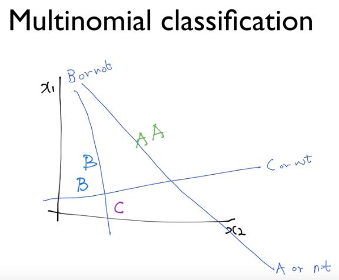
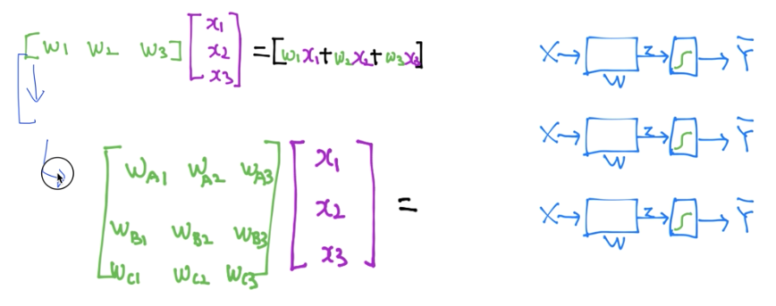
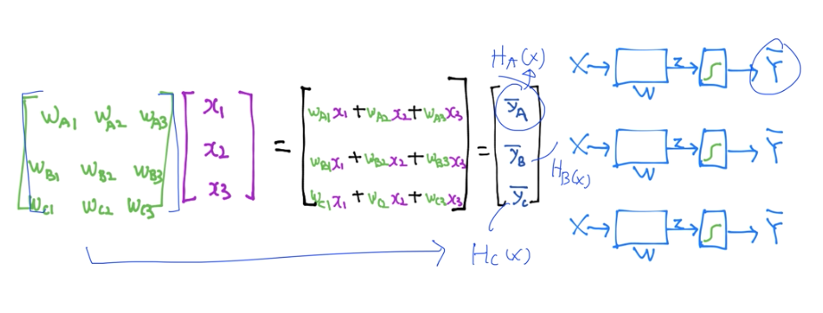
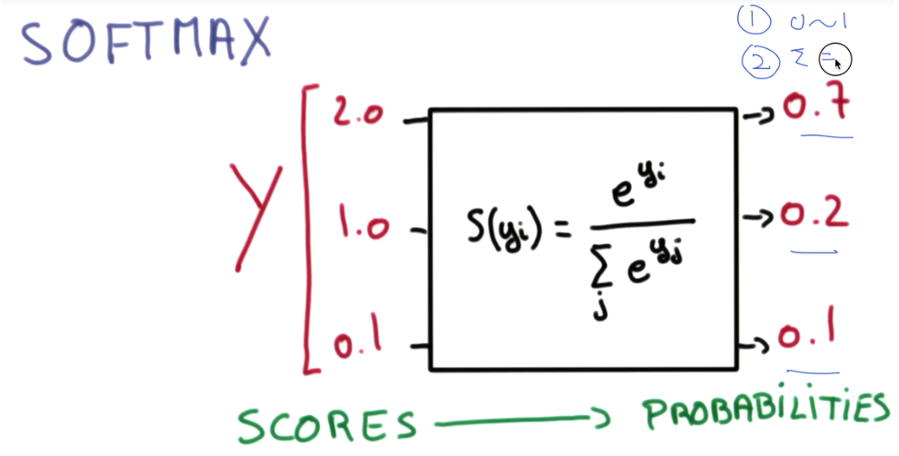
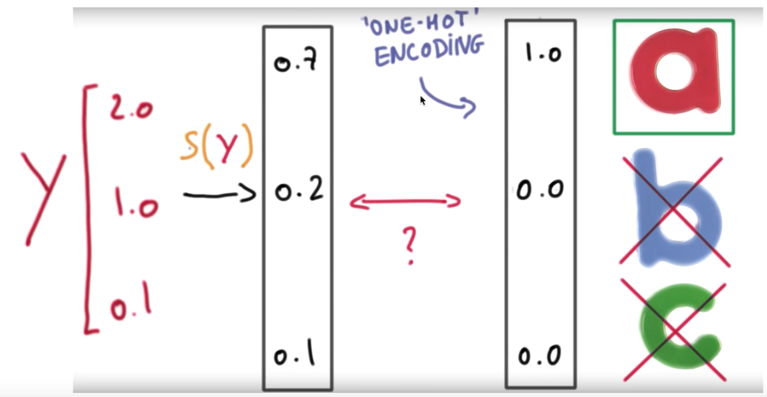
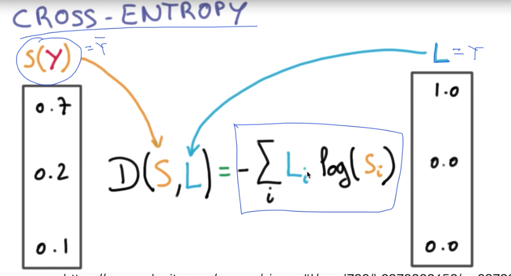
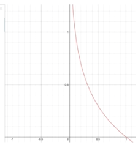
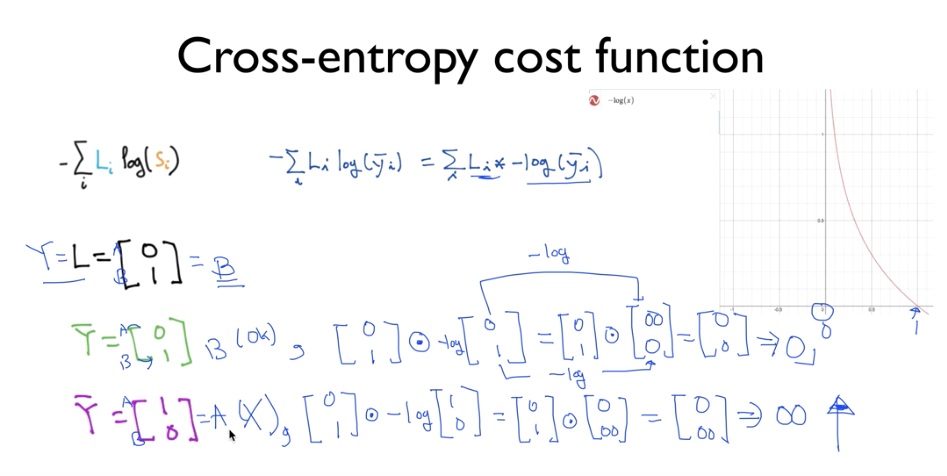
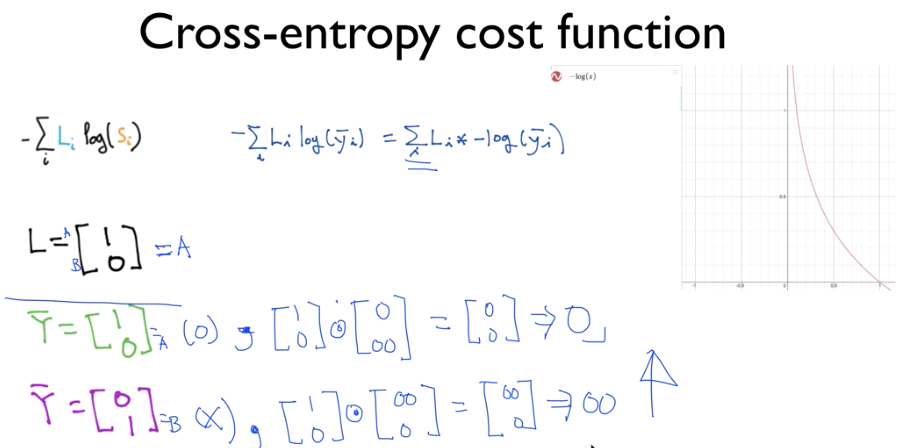

# 6. Lec 06 Softmax Regression (Multinomial Logistic Regression)

#### 2018.09.26(수)

## Intro _ multinomial classification

가장 많이 사용되는 Softmax Regression

우리가 여태까지 배운 Logistic regression의 결과값은 1 또는 0 인 binomial 한 값.

여기서는, 1 or 0 뿐 아니라 더욱 다양한 결과값을 내는  multinomial 값을 도출하기 위해, Softmax  function을 소개할 것.

3개의 class를 구분하기 위해서, 3개의 각각 다른 binary classification model을 가지고도 구현이 가능

독립된 세개의 binary classification model 을 하나의 model 로 합쳐서 표현하자면,

처럼, 각각의 model에 존재하는 여러개의  w 가 하나의 원소로, 그리고 각각의 model 의 w집합이 하나의 행으로 하여 행렬로 나타내고, 각 데이터 (x1, x2, x3)에 대해 적용시킬 수 있다.

아래와 같이!

여기서! 우리는 sigmoid를 각각 처리해줘야 한다! 각 모델 -> 세개에 각각 시그모이드를 적용하는 방법에 대해서, 더욱 간단하게 처리할 수 있는 방법이 있다!

## Softmax classifier 의 cost 함수

이제는, 어떠한 Input값을 넣으면, Output으로 어떠한 vector로 도출 될 것.(여러개의 model 을 동시에 돌린 결과)

여기서, 만약 sigmoid를 적용하지 않으면 우리가 원하는 classifier가 되지 않는다.  0~1사이의 값이 필요.

더 나아가서, 만약 그 결과값이 마치 A가 될 확률 = 0.7, B가 될 확률 = 0.2, C가 될 확률 = 0.1 처럼, 합이 1이되는 값으로 도출되면 어떨까? 하는 아이디어가 발생

-> 단순히 각각 sigmoid를 적용하는 것으로는 만족스럽지 못함! -> softmax classifier의 motivation

즉, 이를 그림으로 표현한다면, 각각의 class에 score가 2, 1, 0.1 이라고 할때 각각 될 확률을 계산해 준다음, 이를 one-hot encoding 하여 최종 class를 결정해준다는 것!

그럼, 이제 Cost function을 구해야겠다.

우리가 여태까지 알고 있던 cost function -> "예측값과 실제값의 거리" 정도로 이해했고, 이를 가정하여 $Cost\ function = \frac{1}{m}\displaystyle\sum^m_{i=1}(H(x^{(i)})-y^{(i)})^2$  라고 하여 , Logistic Regression  에서도  $ H(X) = \frac{1}{1+e^{-W^{T}X}}$ 를 삽입하여 

$ C(H(x),y) = - ylog(H(x)) - (1-y)log(1-H(x))$ 의 결과를 얻을 수 있었다 !

그렇다면,Softmax  Regression 에서는 cost를 어떻게 정의할 것인가? 우리는 Cost function 을 정의함으로써, 궁극적으로 학습을 할 수 있는 기틀이 마련된다!

### Cost function : CROSS-ENTROPY

 S(y)는 우리가 softmax를 적용하여 나온 각 class 별 확률값, 그리고 L은 실제 값 : Y 일때!

이처럼 정의될 수있다.

> HOW??

$ D(S,L) = -\displaystyle\sum_i L_i log(S_i) = -\displaystyle\sum_i L_i log(\bar{y_i}) = \displaystyle\sum_i (L_i)*(-log(\bar{y_i}))$

라고 표현할 수 있고, 이 때, $-log(\bar{y_i}) $ 는 아래와 같은 함수가 나오게 된다.

> 여기서 중요한 것! $L_i$ 를 곱해주므로써, 실제값이 1일때만 고려하게 된다.
>
> 왜냐하면, multinomial의 경우 어느 한 예측값이 Negative인 경우, 다른 model에 의한 예측값 또한  Negative가 되어버리기 때문에, (ex_ $S(y) = [ 0.1, 0.2, 0.25, 0.1, 0.35]$  이고, $\hat{y_i} = [0,1,0,0,0]$  인 경우 한 값만 negative여도 다른 값들또한 negative가 되어버린다. 즉, positive인 경우에 대해서만 고려해야만 하나의 model 에 대해서 cost 가 한번만 읽히게 되는것?) 

아래의 슬라이드를 보면 이해가 훨신 잘 될것.

어챠피 Sum하면 사라지는 것의 의미!

### Logistic cost VS cross entropy

Logistic Cost

-> $ C(H(x),y) = - ylog(H(x)) - (1-y)log(1-H(x))$

이것이 사실상  cross entropy 였던 것!

-> $D(S,L) = -\displaystyle\sum_i L_ilog(S_i)$

 달라보이지만, 혼자 곰곰히 생각해보면, 같다는 걸 알 수 있다. 오늘의 숙제임 곰곰히 생각해볼것

__그리하여, Cost function __

$ L = \frac{1}{N}\displaystyle\sum_i D(S(WX_i+b),L_i)$

 여기서 i 는 각각의 training set을 삽입하는 것을 의미 -> 이를 통해 cost를 구함

그럼, 우리가 이제 해야 할 것은?

### Gradient descent

우리는 이 cost를 최소화 하는 값! vector(w)를 찾아내어야 한다.

우리는 이전과 같이 Gradient descent  를 사용.

위의  cost entropy는 convex function  이기 때문에, 최소값을 구할 수 있다.

근데, 이때

$-\alpha \Delta L (W_1,W_2)$ 여기서 derivative(미분) 이 들어가는데, 이 Loss function이 복잡해져서, 미분이 힘들다. 이 미분은 컴퓨터를 통해서 할 수 있으므로, 따로 다루진 않는다.(매우 복잡.)