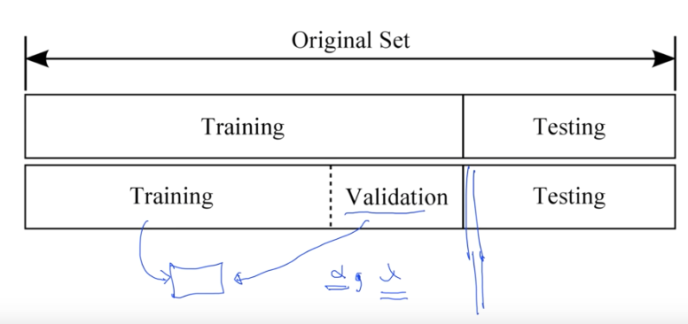

# 7-2. Lec07-2_Application & Tips: Learning and test data sets

### Performance evaluation: is this good?

우리가 이전시간에 배운 것들을 통해 data를 ML  model에 학습시켰음.

그럼,'' 이 모델이 얼마나 훌륭한가? 얼마나 성공적으로 예측하는가?''를 어떻게 평가할까??

__Evaluation using training set?__

만약, 학습시킨 training set으로 만든 ML model 에 다시 training set으로 평가를 한다면, 그것이 과연 옳을까?

! 아니다 ! -> 100퍼센트의 accuracy가 나올수도 있다… -> 마치, 중간고사 시험문제를 모두 풀어보고 그 시험 그대로 보는것과 마찬가지 -> 새로운 데이터가 왔을때 대처를 하지 못하는 경우가 발생

그렇다면 어찌 할까??

__Training and Test sets__

데이터를 7:3 으로 나누어, 7은 Training에 쓰고, 3은 test에 쓰자.

우리는 test set에 대한 label도 알고있으므로, correct를 계산할 수 있다.

Training set으로 model을 학습시키고, test set으로 모델을 평가해야한다! 꼭.

### Training, Validation and test sets

그런데, 여기서 우리가 여태까지 공부하며 나왔던 parameter들 예를들면,

$\alpha $ : learning rate 나, $\lambda $: Regularization strength 같은 값들을 어떻게 결정할지( 어떻게 튜닝할지)

—> Training set을 또다시 완전한  Training set  과 Validation set 으로 나눈다. 그리하여,  Training set으로 model을 학습하고, Validation  set 으로 learning rate 나 Regularization strength 와 같은 parameter들을 튜닝한다! (어떻게 학습시키는 것이 최적인지 결정)

즉, Validation  set으로 모의 실험을 하면서 parameter를 결정하여 학습시키고, 최종적으로 나온  model 과 Test set을 가지고 검증을 하게 된다.

Validation set은 마치 모의고사와 같은 set이다. 실제 시험과 유사한 형태의 시험을 가지고 더 나은 방법을 찾는것.

많은 경우, Training set, Test set으로만 나누기도 한다.

### Online learning

> 만약, Data set이 너무 많아서 이를 한번에 다 넣어 학습시키기가 어려울 경우?(+ 이를 다 메모리에 올리기도 힘들때..)
>
> Online learning을 이용한다 !

만약, 데이터가 100만개가 있다면, 이를 각각 10만개 data씩 잘라서 model  에 학습시킨다.

이때, model 이 해야하는것은! 각 10만개씩 학습시킬때 그 학습의 결과를 기억하고 있어야 한다.

- 이의 장점 : 만약, 데이터 10만개가 추가된다면? 추가된 데이터를 model  에 학습시킬 수 있다!

### MNIST Dataset

[MNIST Dataset](http://yann.lecun.com/exdb/mnist)

이 사이트에 들어가보면, 사람들이 쓴 숫자 데이터가 Training set  과 test set으로 나누어져 있다.

### Accuracy

그렇게해서 도출된 model  의 정확도를 따지는 방법?

- How many of your predictions are correct?
- 95% ~ 99%?
- Check out the lab video.

현재 나오는 이미지 처리는 95~99% 정도의 정확도가 나온다 !

