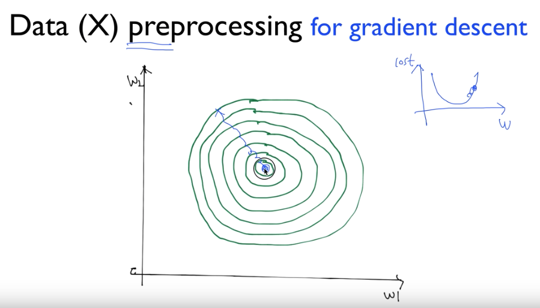
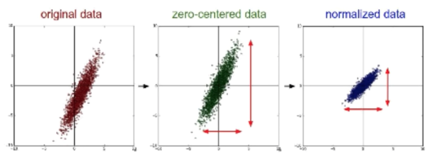
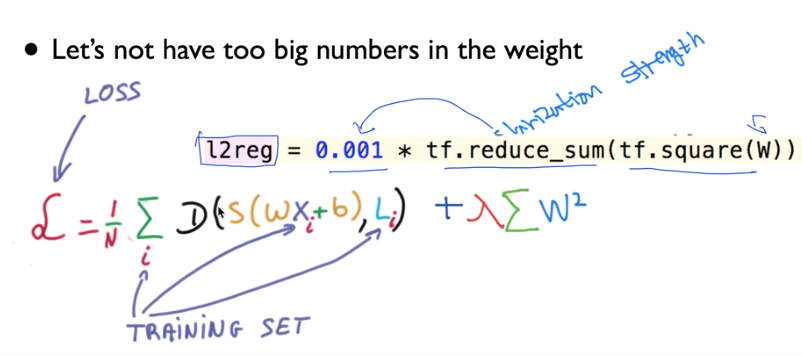

# 7-1. Lec07-1_Application & Tips: Learning rate, data preprocessing, overfitting

>  학습 rate, Overfitting, 그리고 일반화(Regulation)

#### 2018.09.26(수)


## Learning rate

#### Large lerning rate : Overshooting

여기서, learning rate를 우리가 임의로 주었었음. 그런데, 이 learning rate가 매우 중요하다.

> If, 우리가 만약 learning rate를 아주 큰 값을 준다면??

학습이 진행되지 않고, cost가 계속해서 불어날 수 있다. ->Overshooting

#### Small learning rate : takes too long, stops at local minimum

학습이 너무 더뎌서 진행되지 않는다 ->최저점에 도달하기도 전에 시간 초과

이를 확인 하기 위해서는, cost를 확인함으로써,  너무 뎌디게 진행되는지 체크해주어야 한다.

#### Try several learning rates

learning rate를 정하는것에 답은 없다. 몇번의 시도를 통해 최적점을 찾는게 좋다.

몇번 해봐서, Overshooting이나 Time out이 발생하지 않는지..

- Observe the cost function
- Check it goes down in a reasonable rate


## Data Preprocessing

### Data(X) Preprocessing for gradient descent



등고선의 중심점을 minimum 값이라고 한다면, 우리는 학습을 통해 저 cost의 최소값이 되는 부분을 찾아가는 것이 목적이다.

근데, 저 원이 항상 동그란 원을 유지하는 것이 아님. 때로는 feature간 영향으로 인해 치우침이 발생하여 타원형태가 있다.

만약, 우리가 그러한 등고선에서, 조금이라도 밖으로 튀어나가게 되면, 겉잡을 수 없이 cost가 커져버림

이런 경우, 타원형으로 되었거나, 중심을 벗어난 데이터를 preprocessing 하기 위해 많이 사용하는 방법이 zero-centered data 방법과 normalized data 방법이 있다. -> 데이터를 정제하여 맞춰주는 것




즉, 어떤 형태의 항상 범주에 들어가도록 normalize 해주는 것.

그래서, 만약 우리가 learning rate도 잘 잡았는데, 학습이 제대로 되지 않고 cost가 발산하거나, 이상한 동작을 보일 때는 "data중에 크게 차이가 나는가?" 또는 "Preprocessing  을 진행 했는가?"를 체크해 볼 것.


### Standardization

$ x'_j = \frac{X_j- \mu_j}{\sigma_j}$

즉, 

````python
x_std[:,0] = (x[:,0] - x[:,0].mean()) / X[:,0].std()
````

이런식으로 Standardization  한다 - > z-score

사실 여러가지 표준화 방법이 있지만, 가장 잘 맞는걸 선택해서 쓸 것.


## Overfitting

- Out model is very good with training data set(with memorization)
- Not good at test dataset or in real use

즉, 학습데이터에만 너무 딱 맞는 model  이 만들어진다. 그러면, 실제 데이터를 넣었을때는 제대로 작동하지 못하는 것.

__그렇다면, overfitting을 어떻게 줄일 수 있을까??__

### Solutions for overfitting

- More training data! # 학습시킬 데이터가 많으면 더 현실에 가깝게 modeling 된다 !
- Reduce the number of features # 중복되거나, 너무 지나치게 상관관계가 높은 feature를 줄인다 !
- Regularization # 즉, 일반화 시키는 것.

### Regularization

- Let's not have too big numbers in the weight #우리가 가진 weight 을 너무나 큰값을 가지지 말자! 고 하는것.

-> 우리가 데이터를 학습시키다 보면, 만들어진 모델이 모든 데이터에 맞춰서 만들어지려고 하다보면 구불구불해지는데, 그렇게 구부러지게 하지말고 좀 펴자! 라는 아이디어. ( 이렇게 구불구불해지는 것을 overfitting이라고 함)

->  구부러지지 않게 펴자? : weight를 너무 크게 주지 말고, 적은 값을 주자

->  구부러졌다? : 어떤 특정 weight이 너무 큰 값을 가질때 구부러진다.

이를 진행하기 위해서는, 우리가 하는 cost function 의 minimize에서 그 뒤에 term을 주어서, 지나치지 않게 한다!!

즉, 각각의 element를 제곱하여 합하고 regularization strength를 곱해서 더해준다.

이때, regularization strength 값이 1에 가까우면 이 W값을 모두 쓰겠다, 0이면 이 W값을 쓰지 않겠다는 의미!



즉, 이를 수식으로 나타내면

$ L = \frac{1}{N}\displaystyle\sum_i D(S(WX_i+b),L_i) + \lambda \sum W^2$

이 Regularization strength를 곱한, W제곱의 합들을 더한 후 minimum값을 찾아 나가면 된다는 소리이다.

```python
l2reg = 0.001 * tf.reduce_sum(tf.square(W))
```

### Summary

- Learning rate

- Data preprocessing

- Overfitting

  - More training data
  - Regularization


